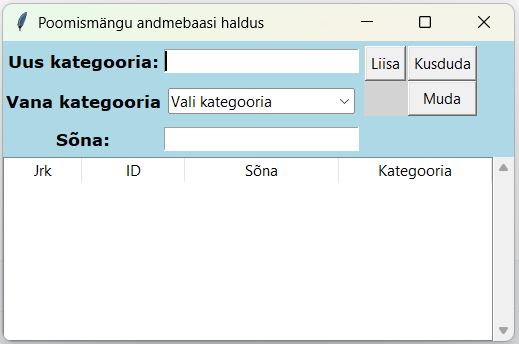

# Hangman 2025 DB Manage

Tegemist on mängu Hangman_2025 andmebaasi haldamise rakenduse disainiga. Õpilastel on vaja siia lisada funktsionaalsus.

# Eelvaade

-

# Tehtud
1. Üldine disain enamus vajalike asjadega on olemas. See pole kivisse raiutud.
2. Lisatud rippmenüü (Combobox) funktsionaalsus. Kuidas rippmenüü võiks toimida.

# Enne põhiülesannet
Antud ülesanne on puhtalt selleks, et saaksite GitHubiga natuke paremini hakkama. Tundub, et see on tekitab vist probleeme. Selle tegemise ajal võib julgelt küsida. Iga punkti juures mõtle miks sa seda teed, miks on see vajalik.
1. Klooni antud projekt enda PyCharm keskkonda
2. Tee vajadusel Python Interpreter seadistused (õige Pythoni versioon). Rakendus vajab töötavat tkinterit.
3. Käivita rakendus main.py failist. 
4. Kui kõik eelnev töötab, siis eemalda Git alt (Alt+9) **Remote** osa (õpetaja GitHub osa)
5. Lisa projekt enda GitHubi
6. Mine muuda nüüd kolme nupu tekst keeleliselt korrektseks.
7. Lisa muudatused (commit) Git-i (lokaalne). Lisa commit tekstiks "Nuppude teksti muudatus"
8. Lisa muudatused GitHubi (interneti)

Kontrolli kas intenetis on ka vastav fail muutunud (commit). Kui midagi läks sassi ja asi ei toimi, siis kustuta projekt
kettalt ja alusta algusest. 

# Põhiülesanne
Teil on vaja lisada funktsionaalsus andmebaasi sõnade lisamiseks, muutmiseks ja kustutamiseks. Rakenduse loogika on 
failis Model.py. Kõik mida kasutaja peaks nägema on failis View.py. See peaks olema enamuses tehtud kuid, võib vajada 
täiendusi või kohandusi. Gettereid võib vajadusel juurde teha. Seal pole ilmselt kõik olemas. Kõikide nuppude funktsionaalsused
peaks olema Controller.py failis ja lahendatud nii nagu rakenduses Hangman_2025 projektis koos tegime.

Luua tuleb kindlasti **Database.py** mis on mõeldud andmebaasiga suhtlemiseks. Andmebaasiga ühendumine ja ühenduse 
katkestamine ning muud meetodid vastavalt ülesandele (lisamine, muutmine, kustutamine). 

Disainis on ekraani alumises osas hetkel ainult tabeli päis. See peab uuenema vastavalt ülemisele vormile. Kui midagi 
lisatakse, peab see peale lisamist kajastuma kohe ka tabelis. Kui muudetakse või kustutatakse siis nii samuti. 

Kuidas lahendada muutmine, siis siin on kaks varianti:
1. Vormil (klikid/topeltklikid tabelis ja andmed tulevad vormi, ning nupp Muuda uuendab andmed tabelis)
2. Tabelis otse (klikid veerul, muudad välja ja Enter klahv salvestab (siin kaotab nupp Muuda mõtte))

Kõik muudatused peavad kajastuma kohe ka andmebaasi tabelis. Kuidas lahendada andmebaasi avamine, ka siin on nüüd kaks 
varianti:
1. Kirjutad andmebaasi nime otse koodi (nagu siiani). Ise määrad kas andmebaas on **databases** kaustas (originaalis pole) või projekti juurkaustas.
2. Teed uue nupu **Ava**, nupu **Lisa** alla, ning ilus askopenfilename avatakse ja kasutaja saab ise valida millise andmebaasi avab.

Viimane oleks kasutajasõbraliku lahendusega, eriti veel siis kui vaikimisi avatakse projekti juurkaust. Andmebaasi 
avamisel **peab kindlasti** kontollima kas see sisaldab tabelit **words** ning kas seal on kolm veergu (id, word, category). 
Kui üks neist tingimustest on vigane, siis on kaks varianti:
* Rakendus lõpetab töö.
* Rakendus loob uue andmebaasi nimega **hangman_2025.db** ning sinna sisse juba tuttav tabel **words** sobivate 
veergudega. Andmebaasi loomisel tuleb vaadata, et sellist andmebaasi juba antud kohas olemas pole. Kui andmebaas luuakse 
kuhugi mujale, siis võiks kuidagi ka kasutajat informeerida (kasutajal on mälu nõrk :wink:) 

Jällegi teine variant on kasutajasõbralikum. Kasutajasõbralikumad versioonid vajavad natuke rohkem pingutamist :wink:

Disainis nuppe võib muuta ja lisada kui on vajadus. Samuti võib vajadusel lisada ka Labele-id. Disain pole kivisse raiutud, kuid sellega liigselt tegeleda pole ka mõtet.
